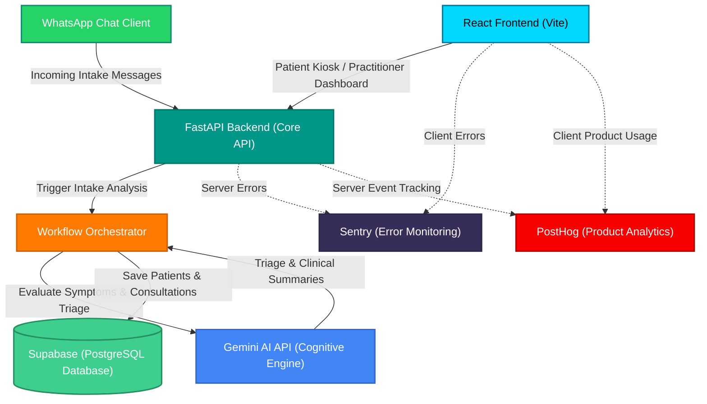

# CliniMax System Architecture

This document describes the system architecture for CliniMax, illustrating the core data flows, service orchestrations, database schemas, and observability stacks active in Week 3.

## Architectural Flowchart

The diagram below represents the system topology, showing how intake requests flow from WhatsApp and the React web client to our backend FastAPI engine, through the workflow orchestrator for Gemini-powered clinical analysis, and into Supabase storage. Both the frontend and backend are instrumented with Sentry and PostHog for real-time observability.

## Description of Components

### 1. Intake Channels
*   **WhatsApp Chat Client**: Receives incoming conversational messages from patients reporting symptoms.
*   **React Frontend (Vite)**: An interactive web interface containing the Patient Kiosk (Intake Chat) and the Clinician Dashboard (including our new **Analytics Dashboard**).

### 2. FastAPI Core Engine
*   Serves as the central API gateway, handling request validation, routing, and CORS middleware for external client integrations.

### 3. Workflow Orchestrator
*   Manages the business logic flow of taking patient inputs, sending structured payloads to the AI model, interpreting classification responses, and persisting records into the data layer.

### 4. Gemini AI API
*   An advanced LLM engine utilized to summarize raw conversational symptoms into EHR-compliant clinical notes and classify patient priority into triage levels.

### 5. Supabase (PostgreSQL)
*   Our persistent data store, expanded in Week 3 to support:
    *   `users`: Practitioner accounts and roles.
    *   `templates`: Clinical intake structures.
    *   `feedback`: Practitioner acceptance ratings on AI-generated notes.
    *   `analytics_events`: Raw tracking events (syncing with client activity).

### 6. Observability Stack
*   **Sentry**: Monitors unhandled exceptions and performance transaction sample rates across the entire stack.
*   **PostHog**: Captures client-side and server-side custom product analytics events.
